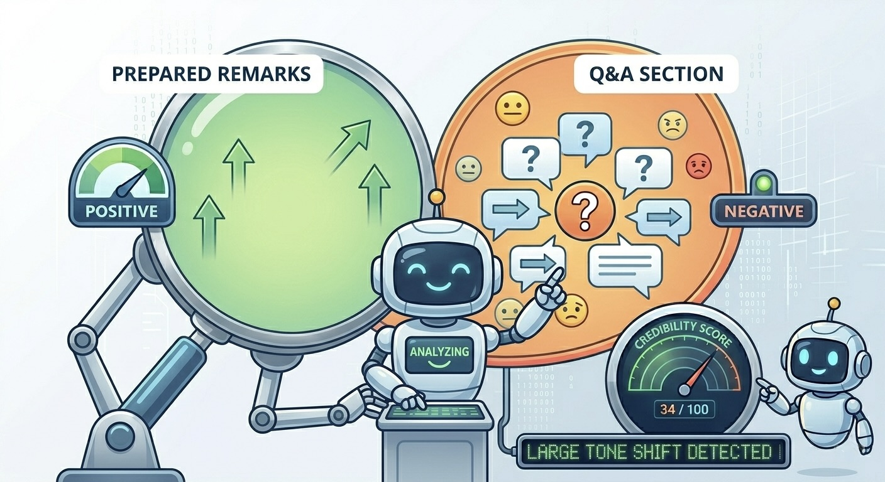
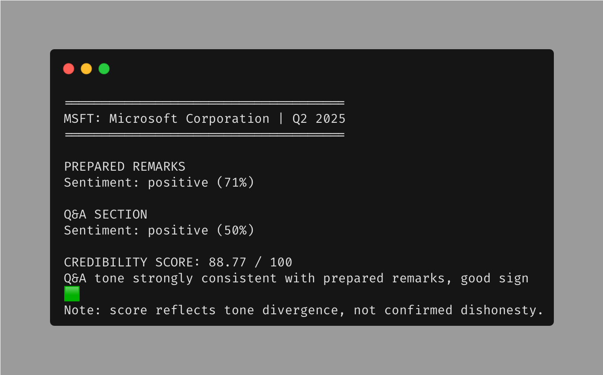
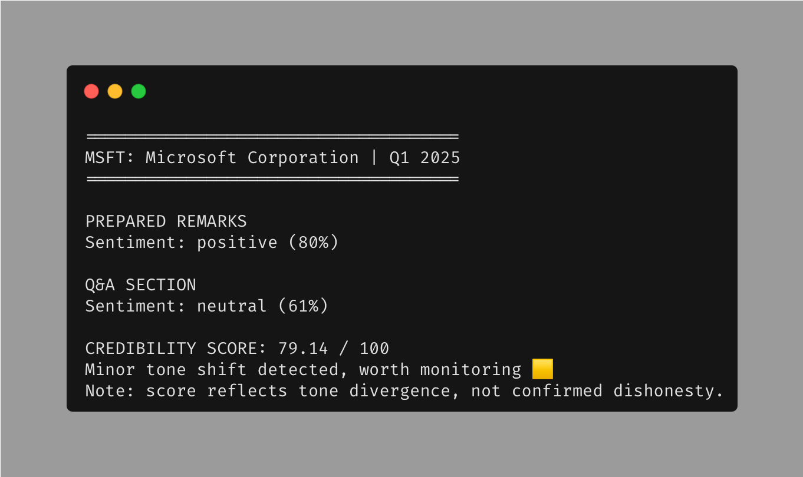

# ToneDelta 📟 — Scanning for tone shifts......

**ToneDelta** — A tool that spots and reports tone shifts between scripted and unscripted portions of a company's earnings call.

## What It Does
Earnings calls are generally split into two sections, namely the prepared remarks and the Q&A sections. The former closely follows the management's script while the latter is often unscripted. Catching the difference between the two quantitatively is exactly what ToneDelta does. Using a pre-trained FinBERT model, ToneDelta outputs a credibility score based on how close in terms of tone the two sections are.

## Why It's Interesting
In the prepared remarks section, every company is confident and optimistic due to the script-reading nature of it. However, in the Q&A section is where the real insight resides as the speaker can't prepare for every single analyst's questions. A CEO that presents numbers confidently but starts hedging heavily under analysts questioning, is hinting at something the numbers are not saying. ToneDelta quantifies this discrepancy into a single number so that you don't have to trawl through thousands of words just to form a similar conclusion.

## Demo
Below are two real outputs from ToneDelta using Microsoft's earnings call transcripts. Notice how the credibility score falls when the management's Q&A tone diverges from their prepared remarks.
<table>
  <tr>
    <td></td>
    <td></td>
  </tr>
  <tr>
    <td align="center">MSFT Q2 2025 — Score 88.77/100</td>
    <td align="center">MSFT Q1 2025 — Score 79.14/100</td>
  </tr>
</table>
Q2 2025 showed stronger consistency between the sections, earning it a strong credibility score of 88.77 while Q1 presented a slight tone shift resulting in a lower score of 79.14, both easily detected by ToneDelta.

## Installation
pip3 install -r requirements.txt

## Usage
python3 main.py --ticker MSFT --year 2025 --quarter 1

## How It Works
**Overall workflow**: *fetch → chunk → FinBERT inference → KL divergence → credibility score → consolidate and print report*

### fetch.py
The *fetch_transcript* function extracts data from the transcript and returns a dictionary containing the prepared remarks section, Q&A section and the name of the company whose earnings call is being analysed.

### analyse.py
The *chunk_text* function then turns the transcript section into smaller, more managable chunks. Each chunk then goes through the *FinBert pipeline* for inference and results are passed on to functions in report.py for further calculations and formatting.

### report.py
*kl_divergence* computes the Kullback-Leibler(KL) Divergence, producing a result showing how similar the distributions of the prepared remarks and the Q&A sections are.

### main.py
The *main* function takes in the all the information gathered from the other modules and produces a clear and actionable report for the user as seen in the **Demo** section above.

## Limitations
### EarningsCall Free Tier Limitations
Within the usage of the free tier, you only get access to two companies — Microsoft (MSFT) and Apple Inc. (AAPL). If you would like to have access to other companies, you have to purchase an API key from [here](https://earningscall.biz/api-pricing).

### Credibility Score's Caveat
The credibility score only shows the deviation between tones in the two sections, not necessarily management dishonesty. In cases where ToneDelta returns a poor credibility score, it should not be taken at face value. Instead, read through the transcript to find out which analyst(s) and what question(s) caused the hedging/defensive answers and cross-reference their published notes for additional context.

### FinBERT on Heavily Hedged Language
The FinBERT model was not trained specifically on earnings call transcripts only. Instead, such transcripts only made up a portion of the [training data](https://huggingface.co/yiyanghkust/finbert-tone). While financial experts might easily see through management stating "we remain cautiously optimistic" or "we are monitoring the situation closely", both carrying subtle negative undertones, FinBERT does not recognise it as the surface-level words do not come off as overtly negative. Consequently, FinBERT has the tendency to report these as neutral, resulting in ToneDelta understating the negativity in transcripts. As a mitigating measure, ToneDelta should be used as a tool of comparison between the two sections rather than an absolute measure of sentiment.

## Tech Stack
Python, HuggingFace Transformers, FinBERT, earningscall, argparse